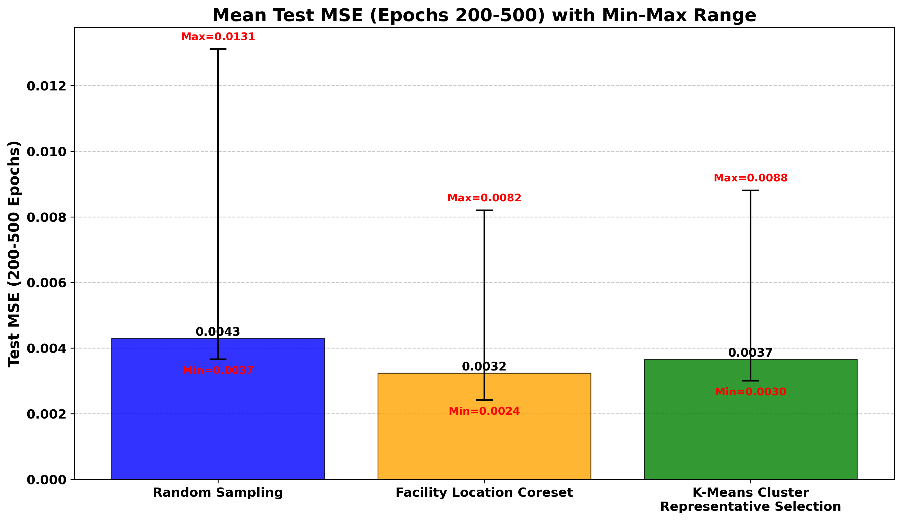
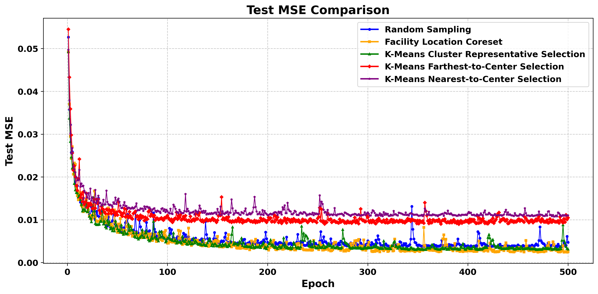
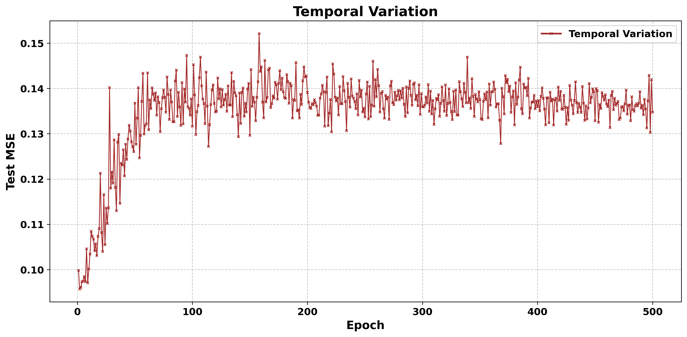

复现方法：首先运行 download.py 下载数据集，并将 CLIP 权重文件放入 src 文件夹；之后选择任一方法对应的文件运行（初次运行耗时较长），注意所有方法可共用 image\_embeddings.pt 与 text\_embeddings.pt 缓存，但其他缓存不能混用，因此运行不同方法前必须清除 computation\_cache 文件夹中的其余缓存文件以避免加载错误；result 文件夹中已包含结构图和图片，如需测试 draw.py 能否与图片对应，请将 result 中的所有 .docx 文件复制到 src 文件夹中再执行。

## 实验结果

### 柱状图

### 折线图

### 时序分析
